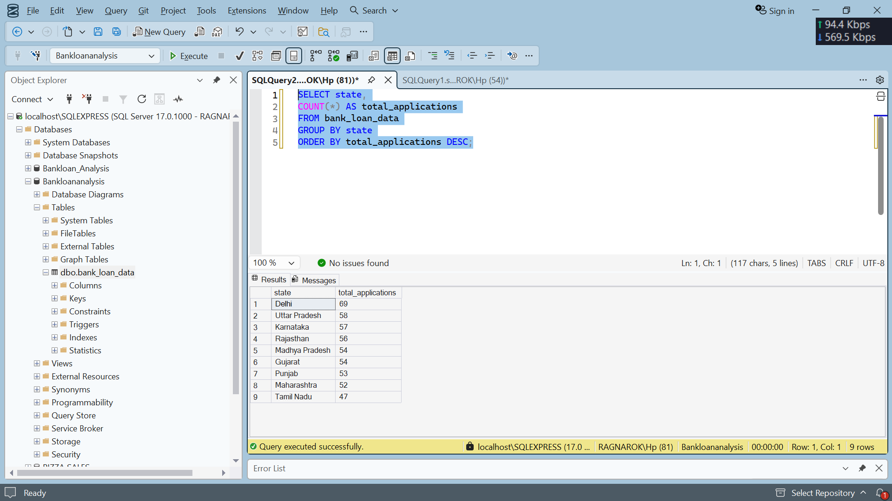
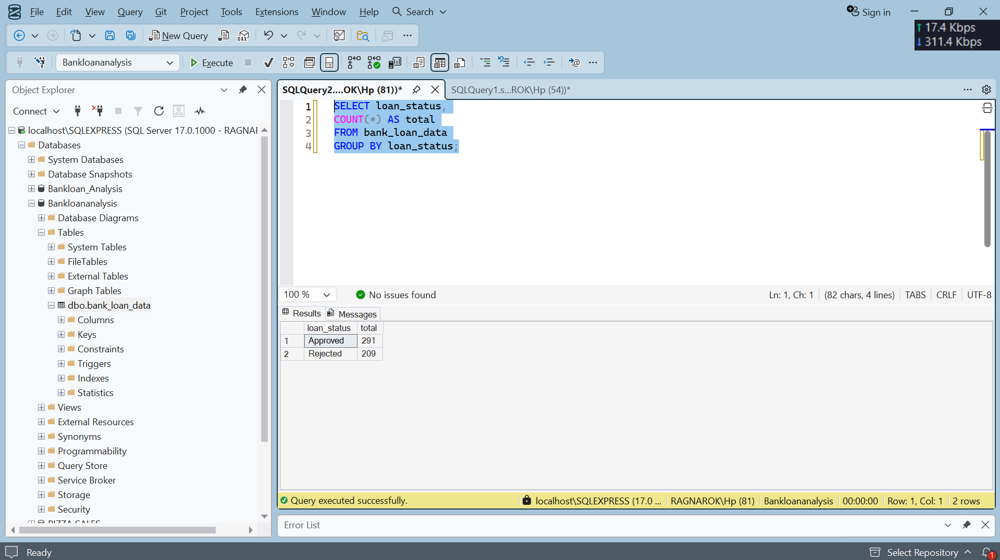

# Bank Loan Analysis using SQL

## Overview
This project analyzes bank loan application data using SQL to identify customer trends, loan approval patterns, and risk categories.

## Tools Used
- SQL Server
- SSMS
- CSV Dataset

## Key Analysis
- Loan approvals and rejections
- Customer income analysis
- State-wise loan trends
- High-risk customer identification
- Loan purpose analysis

## Files Included
- bank_loan_data.csv
- queries.sql
- insights.md
# SQL QUERIES RESULTS

## State-wise Loan Analysis

## Approved vs Rejected Loans

## Conclusion
This project demonstrates SQL-based financial data analysis and business insights generation.
